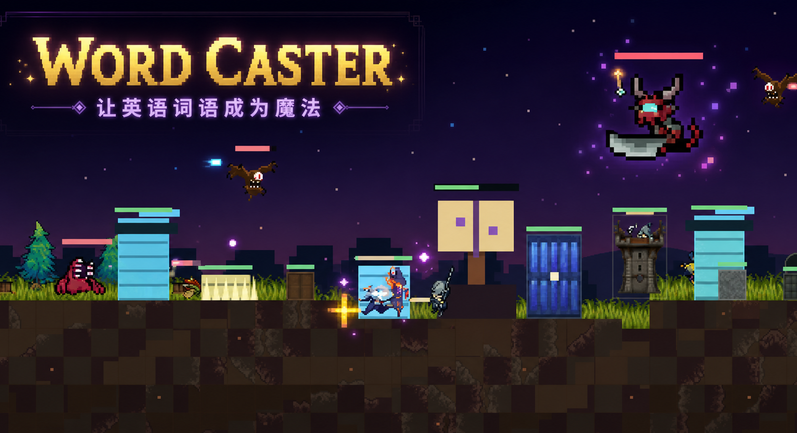

<div align="center">
  <h1>Word Caster</h1>
  <p><strong>让英语词语成为魔法。</strong></p>

  [](https://github.com/ztjklt/wordcaster/actions/workflows/ci.yml)
  
  
</div>



原创中文横版像素言灵守城游戏。玩家是守护“言灵封印”的 Word Caster：
白天在 Caster’s Grimoire 学习英语咒词，夜晚念出词语召唤士兵、
搭建墙、陷阱与炮台，阻挡邪恶法师从召唤门放出的怪物。

战役前3个白昼开放基础建造、四类守军和基础法术，第4个白昼起开放高级言灵。
每个白昼最多首次学习8个词，夜晚可以翻书浏览但不能开始新课程。

## 核心特色

- 将英语单词学习融入语音施法、守城与资源决策
- 支持键鼠、触屏和移动端横屏操作
- 语音不可用时可切换文字输入，不阻断核心玩法
- 包含白昼学习、夜晚战斗、建造、防御塔和高级言灵系统

## 运行

需要 Node.js `>=22.13.0`。

```bash
npm install
npm run dev
npm run typecheck
npm test
npm run build
```

## 操作

- `A / D`：移动
- `Space`：跳跃
- 鼠标左键：近战或使用工匠锤
- 鼠标右键：放置言灵建筑
- 按住 `M`：开启麦克风，松开后识别
- `E / Tab`：打开施法魔典
- `1 / 2`：切换短刀与工匠锤
- `Esc`：取消、关闭书页或暂停

## 分享版

运行 `npm run package:share` 会生成 `Word-Caster-分享版` 文件夹。

运行 `npm run package:douyin` 会生成并校验抖音互动空间目录。正式上传文件为
`word-caster-douyin-volcengine-260428.zip`，ZIP 根目录直接包含 `index.html`。

运行 `npm run package:handoff` 会生成不含 `node_modules` 的
`Word-Caster-队友交接版` 源码交接文件夹，并自动检查依赖与素材是否完整。

## 火山语音

- 抖音互动空间使用 `tt.getRecorderManager()` 录制 AAC，松开施法键后通过
  `tt.callAIChatCompletion()` 调用 `doubao-seed-2-0-lite-260428`。
- 托管网页把录音提交到同源 `/api/transcribe`，由服务端代理调用火山方舟；
  部署时必须把 `ARK_API_KEY` 配置为服务端 Secret，可按 `.env.example`
  配置 `ARK_AUDIO_MODEL`。
- API Key 不进入浏览器代码或抖音 ZIP。服务端限制音频大小、同源请求和调用频率，
  不落盘保存音频。
- 语音不可用或权限被拒绝时，仍可使用文字输入完成游戏。

## 手机与部署

- 手机正式模式为横屏；触控层提供移动、跳跃、近战、放置、工具和暂停。
- 按住底部“按住施法”按钮等价于电脑按住 `M`。
- `railway.json` 已配置 `npm ci && npm run build`、`npm start` 与根路径健康检查。
- 为保护凭据，任何真实 API Key 都不要写入源码、提交记录或静态包。
